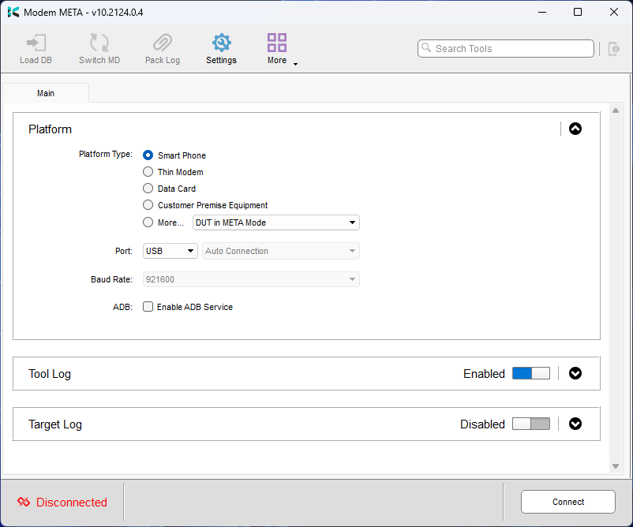
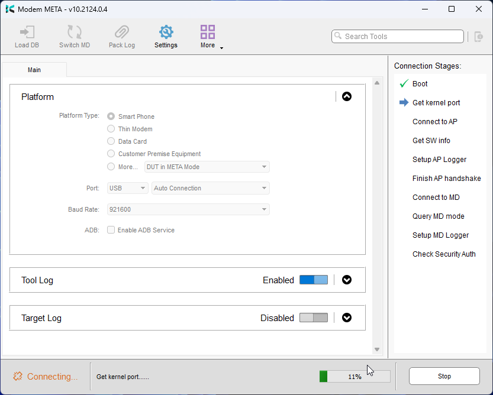
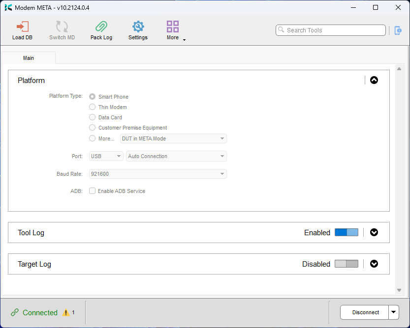
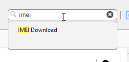
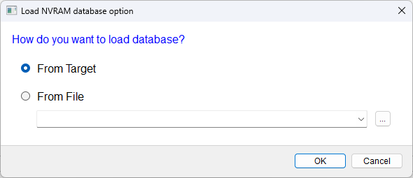
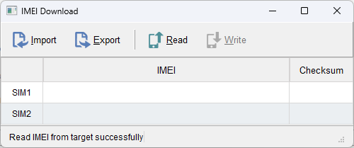
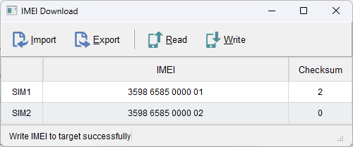
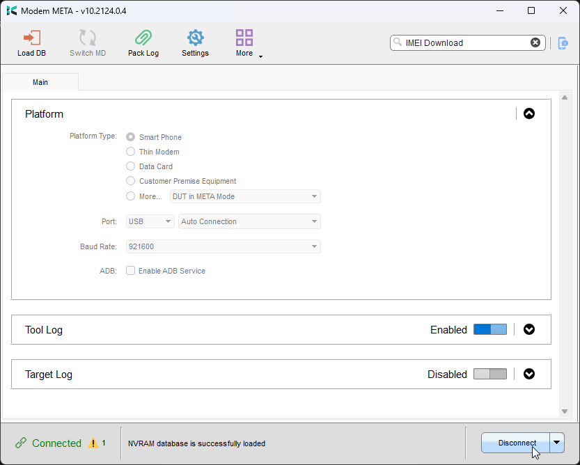

# Restoring your IMEI to your Minimal Phone

Restoring your IMEI may be required in some circumstances

- Testing a `debug` build  
- After restoring to a `user` build from a `debug` build  
- Unbricking your device with `Format All + Download`  

### Requirements  
- Modem META installed  
- USB A-C cable (C-C can work, but if you experience issues please try a A-C cable)  
- Mediatek SoC drivers  
- SIM1 & SIM2 IMEI (You can find this on the box or on the sticker that comes with your device)  

---

1. Power off your Minimal Phone

2. Open `Modem META`

3. Stock options should be okay, click `Connect`

4. Plug in your Minimal Phone

5. Wait for Modem META to connect to your device, this can take up to 60 seconds

6. Once your device is connected you will see a green link icon with `Connected`. If there are any warnings you can ignore them.

7. In the top right corner, use the search bar to search for `IMEI Download`

8. Select `Read`, if prompted select `From Target`

9. You should see `Read IMEI from target successfully`

10. Double click the field for the IMEI you want to restore and type it in

> Please note that it will only let you type in 14 numbers, and the final number will fill in the `Checksum` column. (Ensure this is correct)

11. You can then write the IMEI to your device by clicking `Write`, it should only take a few seconds and you should see `Write IMEI to target successfully`

12. Your IMEI is restored! Now close the `IMEI Download` window and click `Disconnect` in the Modem META window, and wait for `Disconnected` to show

13. Unplug and power on your device, you should now be able to connect to a celluar network.

:::tip Note

Please note WiFi and Bluetooth MAC addresses shouldn't be affected by this. If either of them are missing ensure WiFi + Bluetooth are enabled and check again.

:::