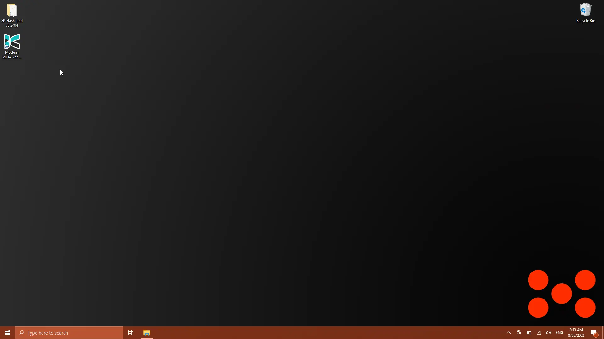
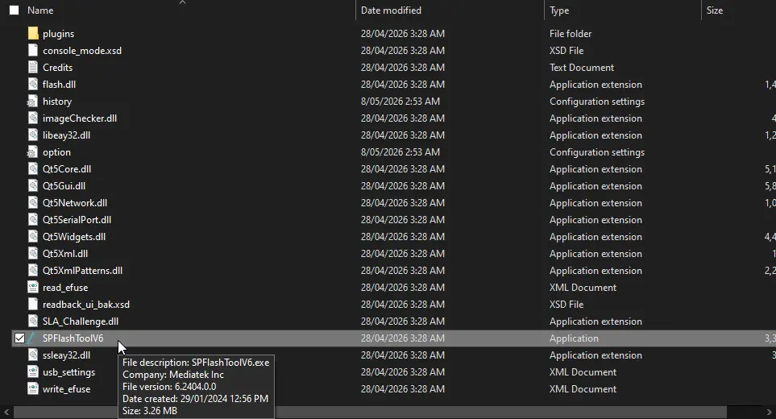
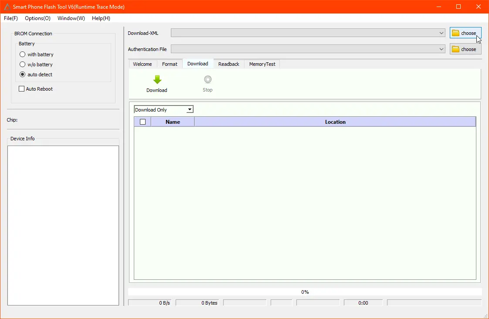
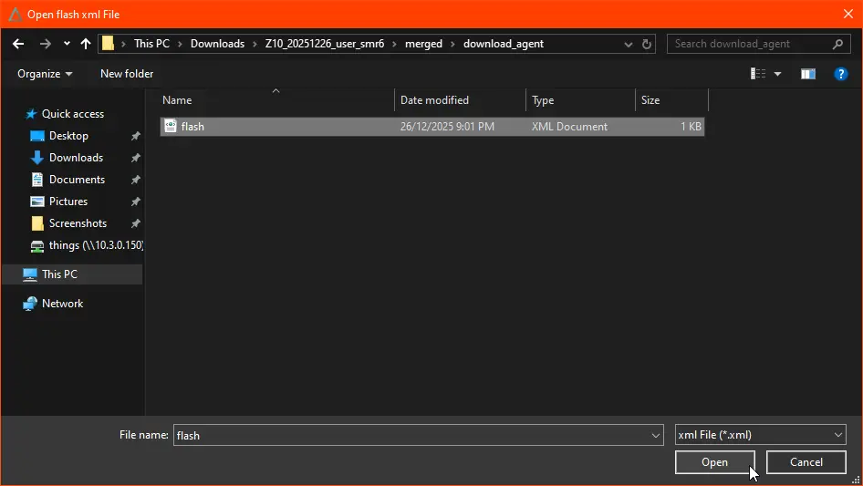
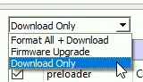
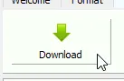
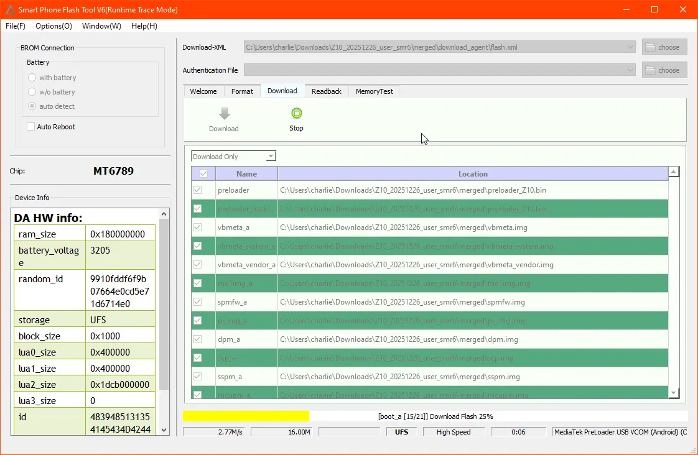
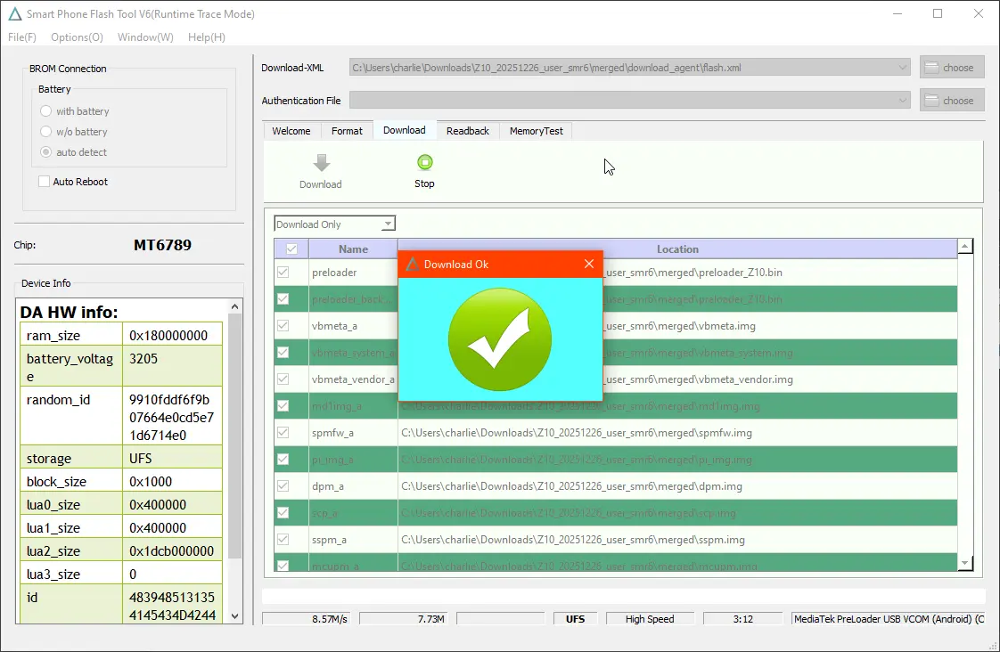
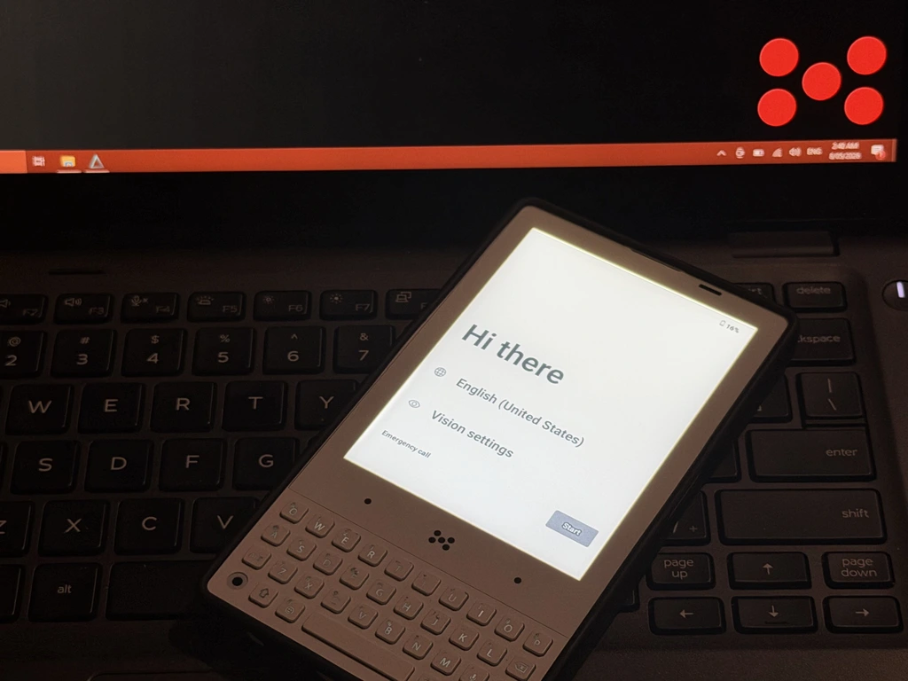

# Flashing your Minimal Phone with SP Flash Tool

This guide walks through flashing a build to your Minimal Phone using SP Flash Tool.

:::danger

Don't unplug the phone or close SP Flash Tool while a flash is in progress. Interrupting a flash can leave the device unbootable.

:::

### Requirements

- A Windows PC with [drivers and SP Flash Tool installed](windows-setup)
- A USB A-C cable (C-C can work, but if you experience issues please try a A-C cable)
- A build extracted to a folder on your PC, containing a `flash.xml` inside its `download_agent` folder
- Your Minimal Phone, with at least some charge

---

## 1. Open SP Flash Tool

If you completed the [Windows setup](windows-setup), you should have a folder for `SP Flash Tool` and shortcut for `Modem META` on your desktop.

Navigate into the SP Flash Tool folder you extracted earlier and run `SPFlashToolV6.exe`.

## 2. Load the flash XML

In the top right of the SP Flash Tool window, click the `choose` button next to `Download-XML`.

Navigate into your extracted build folder, then into `download_agent`, and select `flash.xml`. Click `Open`.

The file list will populate with the partitions to be flashed.

## 3. Set the flash mode to "Download Only"

In the dropdown above the file list, ensure `Download Only` is selected.

:::caution Format All + Download

Selecting `Format All + Download` will erase **all** data on your device, **including the IMEI and other calibration data**. Using this option is **not** reccomended, be prepared to [restore your IMEI](restore-imei) afterwards, there also may be other unforseen consequences.

:::

## 4. Start the flash

Click the green `Download` button to arm SP Flash Tool. It will now wait for your phone to connect.

## 5. Connect your phone

With your Minimal Phone **powered off**, plug it into your PC using a USB cable.

SP Flash Tool will detect the device. The chip will be identified as `MT6789`, the `Device Info` panel on the left will populate, and the progress bar at the bottom will turn yellow as flashing begins.

:::danger

Don't unplug the phone or close SP Flash Tool until the flash completes.

:::

## 6. Wait for completion

When the flash finishes, a `Download Ok` dialog with a green checkmark will appear.

You can now unplug your phone and power it on by holding the power button.

If everything went well, you'll be greeted by the `Hi there` welcome screen, ready to set up from scratch.

---

If you used `Format All + Download`, follow the [IMEI restoration guide](restore-imei) before connecting to a cellular network. Future guides will show how to backup the `NVRAM` and other sensitive partitions **first** before Formatting your device.
