# Windows Driver/Program Setup

Before you can flash builds or restore your IMEI on Windows, you'll need a few programs and the Mediatek drivers installed. This guide walks through the full setup.

### What you'll need

- A Windows 10 (or newer) PC
- A USB A-C cable (C-C can work, but if you experience issues please try a A-C cable)
- The following installers downloaded to your PC:
  - [**MTK.Drivers.exe**](https://github.com/minimalcompany/tools/releases/download/MP01/MTK.Drivers.exe) (Mediatek SoC drivers)
  - [**ModemMETA_v10.2124.0.04.exe**](https://github.com/minimalcompany/tools/releases/download/MP01/ModemMETA_v10.2124.0.04.exe) (used for restoring IMEIs)
  - [**SP.Flash.Tool.v6.2404.zip**](https://github.com/minimalcompany/tools/releases/download/MP01/SP.Flash.Tool.v6.2404.zip) (used for flashing builds)

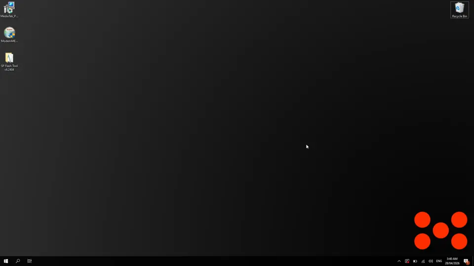

---

## 1. Install the MediaTek USB VCOM Drivers

:::tip Note

Before starting, unplug your Minimal Phone (and any other Mediatek devices) from your PC. The installer will refuse to continue if any Mediatek USB device is connected.

:::

1. Run `MTK.Drivers.exe`

2. Click `Next` through the prompts, leaving the install location at the default

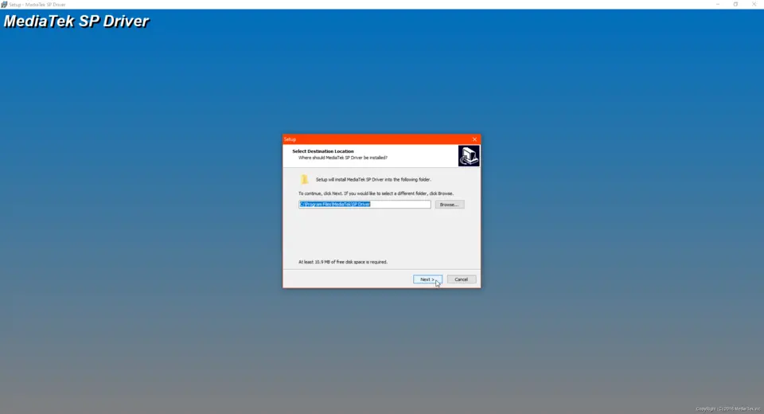

3. If you see the `Please remove USB device first. Continue?` prompt, unplug your phone and click `Yes`

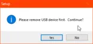

4. A console window will appear and install a long list of USB device entries. This is normal, let it run to completion.

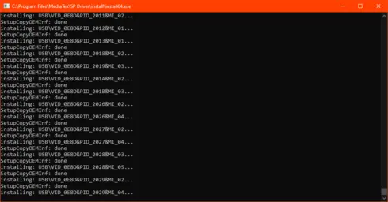

:::tip Ignore driver signature warnings

If Windows shows any warnings about driver signature verification during this step, ignore them and allow the install to continue. The Mediatek drivers are unsigned and these warnings are expected.

:::

5. When prompted to restart, click `OK` but **do not reboot yet**, finish the rest of the setup first so you only restart once.

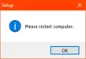

---

## 2. Install Modem META

1. Run `ModemMETA_v10.2124.0.04.exe`

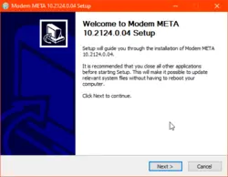

2. Click `Next`, then leave the destination folder at the default and click `Install`

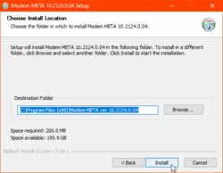

3. When the installer finishes, **untick** `Run Modem META` and click `Finish`

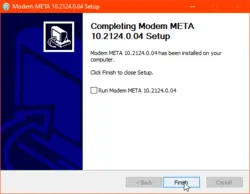

---

## 3. Extract SP Flash Tool

SP Flash Tool does not have an installer, it runs directly from its extracted folder.

1. Extract `SP.Flash.Tool.v6.2404.zip` to a location of your choice (your Desktop is fine)

2. Inside the extracted folder, you'll find `SPFlashToolV6.exe`. This is the program you'll launch when flashing.

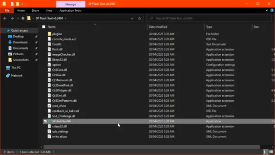

:::tip Note

Don't move `SPFlashToolV6.exe` out of its folder, it depends on the surrounding `.dll` files to run.

:::

---

## 4. Restart your PC

Now that everything is installed, restart your PC to finish the driver installation.

After your PC boots back up, you should have shortcuts for `SP Flash Tool` and `Modem META` ready to use.

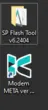

You're now ready to follow the [flashing](sp-flash-flashing) or [IMEI restoration](restore-imei) guides.

---

## Troubleshooting

### SP Flash Tool or Modem META fails to launch

Both tools depend on the **Microsoft Visual C++ Redistributable**. If either tool refuses to start or shows a `.dll`-related error, install the [VisualCppRedist AIO](https://github.com/abbodi1406/vcredist/releases/download/v0.104.0/VisualCppRedist_AIO_x86_x64.exe) bundle, which covers every version both tools may need:

1. Run `VisualCppRedist_AIO_x86_x64.exe`

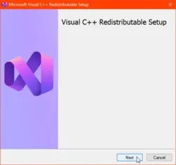

2. Click `Next` and let it extract

3. Wait for Windows to finish configuring it

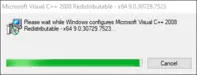

4. Try launching the tool again.

### Last resort: disabling driver signature enforcement

If your PC still refuses to load the Mediatek drivers after a restart (e.g. Device Manager shows a yellow triangle next to the device, or Windows blocks the install with a signature error you cannot bypass), you may need to temporarily disable driver signature enforcement and reinstall the SP Driver.

:::tip Note

Most users will **not** need this step, the warnings shown during the normal install are safe to ignore. Only follow this section if the drivers actually fail to load after a reboot.

:::

1. Open `Settings` → `Update & Security` → `Recovery`

2. Under `Advanced startup`, click `Restart now`

> Alternatively, hold `Shift` while clicking `Restart` from the Start menu's power options.

3. Once your PC reboots into the recovery menu, select `Troubleshoot` → `Advanced options` → `Startup Settings` → `Restart`

4. When the Startup Settings menu appears, press `7` (or `F7`) to select `Disable driver signature enforcement`

5. Once Windows boots, re-run `MTK.Drivers.exe`

6. Restart normally, the drivers will remain installed, but signature enforcement will turn back on for everything else.
