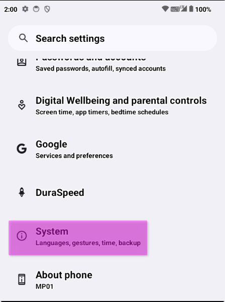
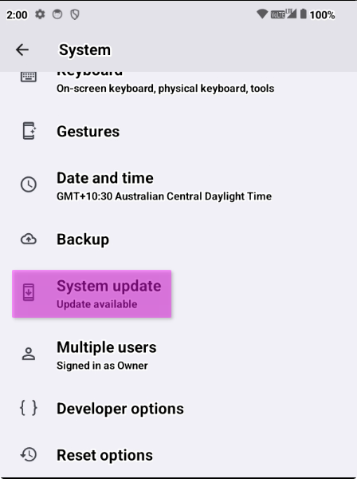
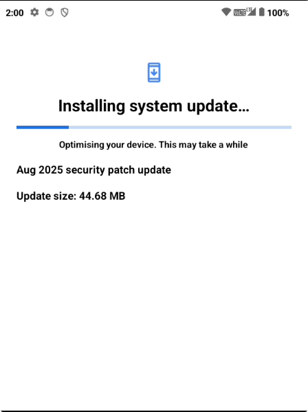
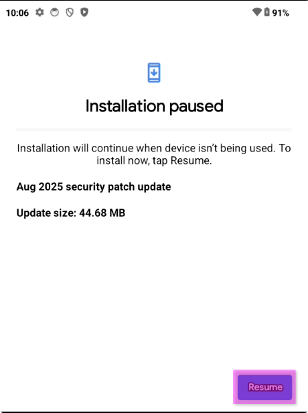

# Updating your Minimal Phone

Before you setup your Minimal Phone, you should always update it to the latest version of the software to ensure you have the latest improvements and security updates!

## Updating

1. Open `Settings` (From the app drawer or swipe down from the top to access quick settings, and open it with the gear icon)

2. Scroll down to `System` and tap on it

3. Scroll until you see `System update` and tap it

4. The update should start from here.

5. If the screen shows, "Installation paused", you can force it to resume and update ASAP, otherwise it'll update when you're not using the device.

## Troubleshooting

If your update fails with `Installation Failed`, check your connection, try restarting your device and try again.

If you see `Can't check for update`, check your connection, try restarting your device and try again. If this is a replacement device, contact support.

