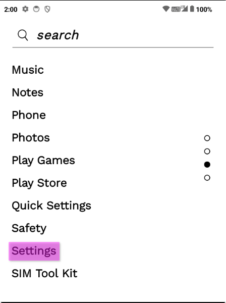
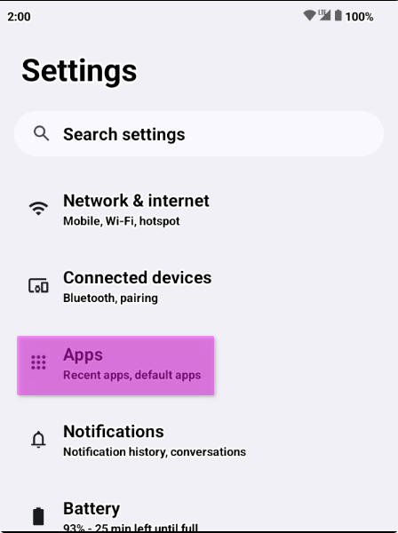
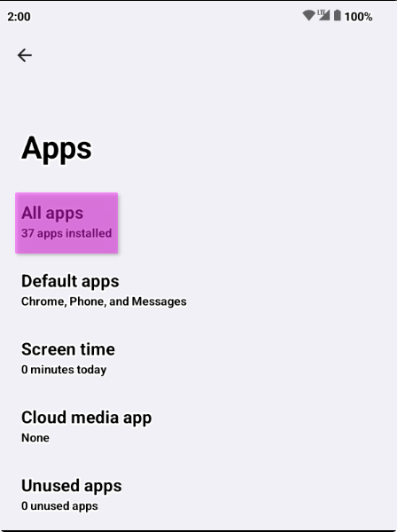
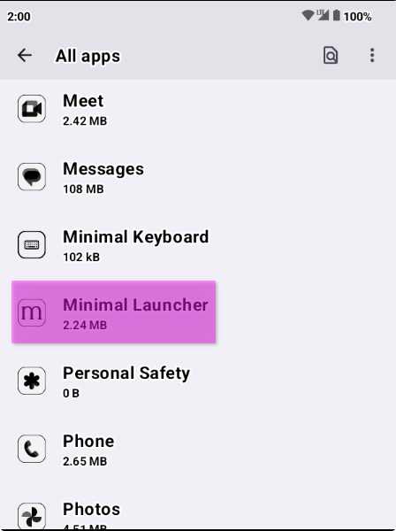
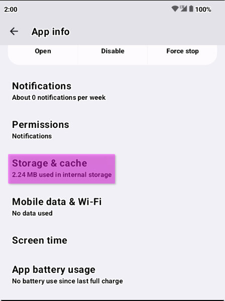
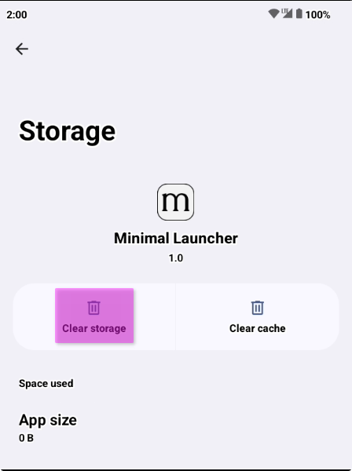
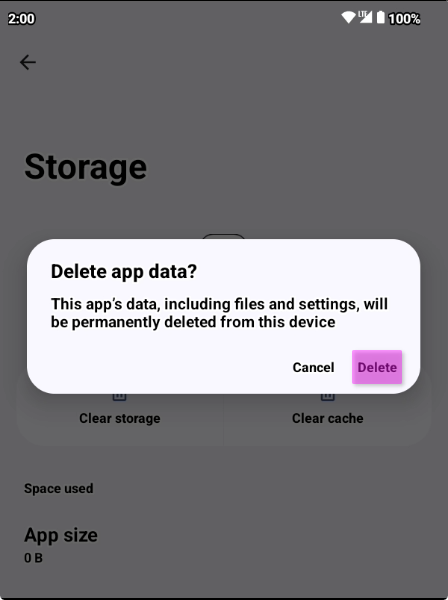

# [App] has stopped - Upon startup

Earlier versions of the Minimal OS didn't properly migrate all preferences and data between upgrades, and occasionally some of the Minimal apps can give you a message upon bootup that is something like:

```
Minimal Launcher has stopped
```

### Affected Apps

This can affect the following apps:
- Minimal Launcher
- Minimal Keyboard
- Quick Settings

### Solution

To solve this problem, we may be able to just reset the app data, this will remove any configuration or preferences, but will stop the crashing issue.

1. Open `Settings` (From the app drawer or swipe down from the top to access quick settings, and open it with the gear icon)



2. Once you're in settings, navigate to `Apps`



3. Select `All apps`



4. Scroll and find your affected app, tap on it



5. In `App info` on your affected app, select `Storage & cache`



6. Select `Clear storage`

:::danger Warning

This is your final warning, this will clear all app data, preferences and configuration, ensure you want to do this before continuing.

:::



7. Select `Delete` to Delete the apps data

