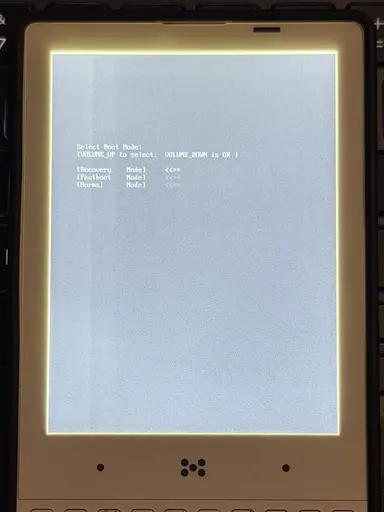
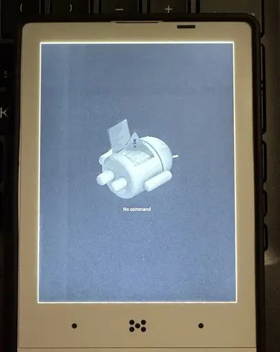
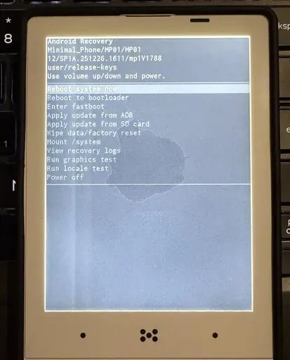
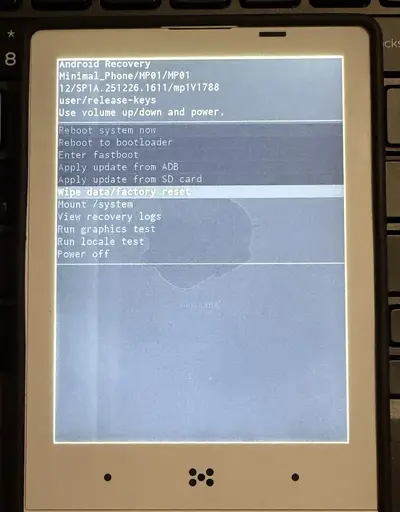
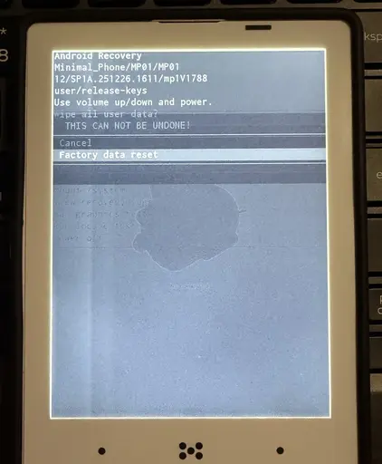
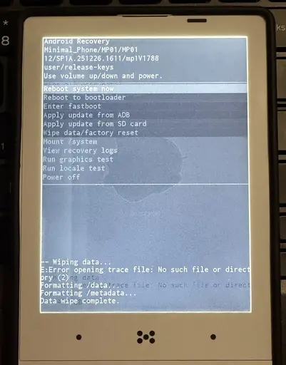

# Factory resetting your Minimal Phone

A factory reset wipes all user data on the device and returns it to an "out of the box" state. This can be useful when troubleshooting, before selling or handing off the device, or to clear a bootloop.

:::danger

This will erase **all** data on your phone (apps, accounts, messages, files). It cannot be undone.

:::

---

## 1. Power off the device

Hold the **Power** button and select `Power off` from the menu.

:::tip Bootlooping or unresponsive?

If your phone won't shut down normally (stuck on a boot screen, frozen, or otherwise unresponsive), you can skip this step entirely. Just **hold Power + Volume Up together** and keep holding through the screen turning off until the `Select Boot Mode` screen appears in step 2.

:::

## 2. Boot into the Boot Mode menu

With the device fully off, **hold Power + Volume Up together** until you see the `Select Boot Mode` screen.

You'll see three options: `Recovery Mode`, `Fastboot Mode`, and `Normal Mode`. The on-screen hint reads `VOLUME_UP to select. VOLUME_DOWN is OK.`

- Press **Volume Up** to cycle through the options until `Recovery Mode` is the highlighted row
- Press **Volume Down** to confirm

## 3. Wait for the "No command" screen

After confirming, the device will show a small Android robot with `No command` underneath. This is expected.

To progress past this screen:

1. Press and **hold the Power button**
2. While still holding Power, **tap Volume Up once**
3. Release both buttons

## 4. Navigate the recovery menu

You should now see the Android Recovery menu. The header shows `Use volume up/down and power.`

- Press **Volume Down** repeatedly to move the highlight down to `Wipe data/factory reset`
- (Use **Volume Up** if you overshoot and need to move back up)

- Once `Wipe data/factory reset` is highlighted, press the **Power** button to select it

## 5. Confirm the factory reset

A confirmation screen will appear with the warning `Wipe all user data? THIS CAN NOT BE UNDONE!` and two options: `Cancel` (highlighted by default) and `Factory data reset`.

- Press **Volume Down** once to move the highlight from `Cancel` to `Factory data reset`
- Press the **Power** button to confirm

The device will now wipe its data. You'll see status messages at the bottom of the screen ending with `Data wipe complete.`

## 6. Reboot

Once the wipe finishes, the menu returns and `Reboot system now` is highlighted at the top.

- If `Reboot system now` is not already highlighted, use **Volume Up** to move back to it
- Press the **Power** button to select it

Your phone will reboot into a fresh setup. The first boot after a factory reset can take a few minutes, please be patient.

Once it finishes, you'll be greeted by the `Hi there` welcome screen, ready to set up from scratch.

